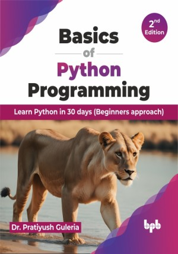

# Basics of Python Programming - 2nd Edition

Mastering the Python fundamentals with practical examples

This is the repository for [Basics of Python Programming - 2nd Edition
](https://bpbonline.com/products/basics-of-python-programming?variant=43549000532168),published by BPB Publications.

## About the Book
The basics of Python are the book's main focus. With practical examples, students will understand the fundamentals of Python. This book is designed in a way that should make every example understandable to the readers. In addition, from the perspective of a competitive examination, the book offers multiple-choice questions, true/false questions, and practical solved exercises.

Through this book, the readers will be able to learn Python basics. This includes setting up your environment and manipulating data. Additionally, they will also learn how to master control flow with conditional statements and loops for more responsive programs and utilize functions for organizing code and file handling to work with local data. Learners will also explore object-oriented programming (OOP) and essential libraries like NumPy for advanced programming.
This edition brings a new horizon of NumPy and Tkinter for numerical computing tasks like array manipulations, tackling complex problems, and building user-friendly applications with interactive graphical interfaces, respectively.

From every chapter, the reader will learn the programming fundamentals and will be able to execute the programs on their own.

## What You Will Learn
• Install and run Python programs, understand variables, user input, and operators.

• Organize code and improve reusability by defining and using functions.

• Store and manage data efficiently using lists, tuples, and dictionaries.

• Organize data effectively using iterators and generators for memory optimization.

• Gracefully handle errors and exceptions to improve program robustness.
